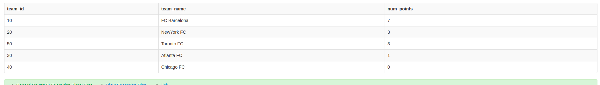
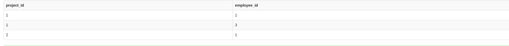
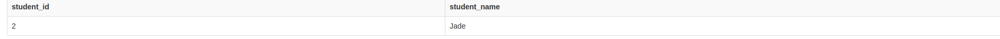

#### **Problem Statement 1 **
You would like to compute the scores of all teams after all matches. Points are awarded as follows:

 - A team receives three points if they win a match (i.e., Scored more goals than the opponent team).

 - A team receives one point if they draw a match (i.e., Scored the same number of goals as the opponent team).

 - A team receives no points if they lose a match (i.e., Scored fewer goals than the opponent team).
Write an SQL query that selects the team_id, team_name and num_points of each team in the tournament after all described matches.

Return the result table ordered by num_points in decreasing order. In case of a tie, order the records by team_id in increasing order.

#### **Explanation (2-3 lines)**
To determine various game outcomes based on the teams involved, I first calculated the points for the host team and guest team separately. Next, I merged the results using the "union all" operation. Then, I combined the entries with the same team name and added up their points using the "group by" clause.

#### **Solution**
<pre><code> SELECT
    team_id,
    team_name,
    SUM(team_points) AS num_points
FROM
(
    SELECT
        team_id,
        team_name,
        CASE
            WHEN host_goals > guest_goals THEN 3
            WHEN host_goals = guest_goals THEN 1
            ELSE 0
        END AS team_points
    FROM matches
    RIGHT JOIN teams ON matches.host_team = teams.team_id

    UNION ALL

    SELECT
        team_id,
        team_name,
        CASE
            WHEN guest_goals > host_goals THEN 3
            WHEN host_goals = guest_goals THEN 1
            ELSE 0
        END AS team_points
    FROM matches
    RIGHT JOIN teams ON matches.guest_team = teams.team_id
) AS points
GROUP BY team_id, team_name
ORDER BY num_points DESC, team_id;
</code></pre>

**Result Screenshot**

### **Problem Statement 2 **
Write an SQL query that reports the most experienced employees in each project. In case of a tie, report all employees with the maximum number of experience years.

#### **Explanation (2-3 lines)**
Within our various projects, multiple employees are working. I have obtained the maximum experience for each project, which allows me to identify the employee with the highest experience level within each individual project.

#### **Solution**
<pre><code> 
SELECT project_id, emp.employee_id
FROM project
JOIN employee emp ON project.employee_id = emp.employee_id
WHERE emp.experience_years IN (
    SELECT MAX(employee.experience_years) AS most_experience
    FROM project
    JOIN employee ON project.employee_id = employee.employee_id
    GROUP BY project_id
);
</code></pre>

**Result Screenshot**

---

### **Problem Statement 2 **
Write an SQL query that reports the most experienced employees in each project. In case of a tie, report all employees with the maximum number of experience years.

#### **Explanation (2-3 lines)**
Within our various projects, multiple employees are working. I have obtained the maximum experience for each project, which allows me to identify the employee with the highest experience level within each individual project.

#### **Solution**
<pre><code> 
SELECT project_id, emp.employee_id
FROM project
JOIN employee emp ON project.employee_id = emp.employee_id
WHERE emp.experience_years IN (
    SELECT MAX(employee.experience_years) AS most_experience
    FROM project
    JOIN employee ON project.employee_id = employee.employee_id
    GROUP BY project_id
);
</code></pre>

**Result Screenshot**

---

### **Problem Statement 3 **
Write an SQL query to find the names of all the activities with neither the maximum nor the minimum number of participants.
Each activity in the Activities table is performed by any person in the table Friends.

#### **Explanation (2-3 lines)**
I calculated the count of activities and determined the maximum and minimum counts. I then used these results in a "where" clause to filter out the activities with the maximum and minimum counts, considering only the remaining activities.

#### **Solution**
<pre><code>
SELECT activity
FROM friends
GROUP BY activity
HAVING COUNT(activity) <> (
    SELECT MIN(activity_count)
    FROM (
        SELECT COUNT(activity) AS activity_count
        FROM friends
        GROUP BY activity
    ) AS counts
)
AND COUNT(activity) <> (
    SELECT MAX(activity_count)
    FROM (
        SELECT COUNT(activity) AS activity_count
        FROM friends
        GROUP BY activity
    ) AS counts
);
</code></pre>

**Result Screenshot**

---

### **Problem Statement 3 **
A quiet student is the one who took at least one exam and did not score the high or the low score.
Write an SQL query to report the students (student_id, student_name) being quiet in all exams. Do not return the student who has never taken any exam.

#### **Explanation (2-3 lines)**
The query filters out students who obtained the highest or lowest scores on a specific exam by comparing their scores with the maximum and minimum scores achieved by other students in the same exam. It then groups the results by student ID and includes only those students who have appeared in more than one exam, as determined by the "HAVING" clause.

#### **Solution**
<pre><code>
SELECT students.student_id, student_name
FROM students
JOIN exams e1 ON students.student_id = e1.student_id
WHERE score NOT IN (
  SELECT MAX(e2.score)
  FROM exams e2
  WHERE e1.exam_id = e2.exam_id
  UNION
  SELECT MIN(e2.score)
  FROM exams e2
  WHERE e1.exam_id = e2.exam_id
)
GROUP BY student_id
HAVING COUNT(*) > 1;
</code></pre>

**Result Screenshot**
